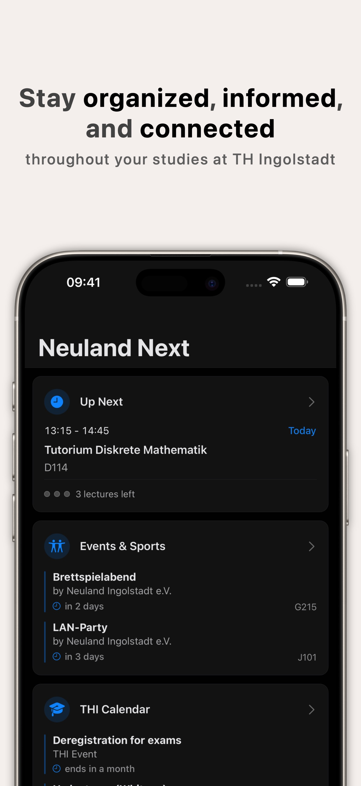
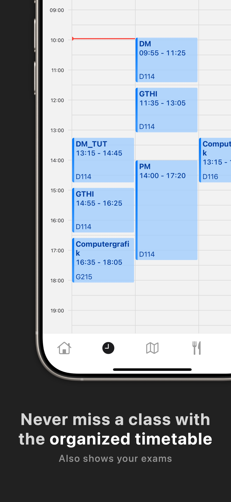
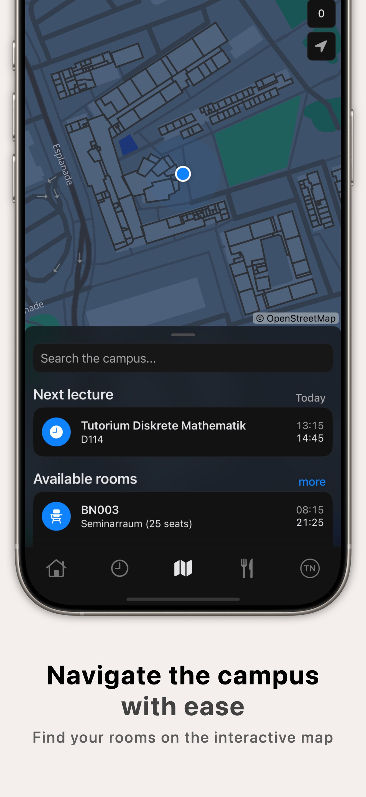

# Neuland Next - Your unofficial app for THI

  
  

Neuland Next is an unofficial app for students of the Technische Hochschule Ingolstadt (THI). It's an open source, mobile app developed using React Native, designed to provide a modern alternative to the official THI app with a better user experience and more features.

## Features

  
  
  

- **Timetable & Exams**: View your personal timetable from PRIMUSS and your exams at a glance
- **Calendar & Events**: Access all important semester dates, campus events and university sports in one place
- **Profile**: View your grades, printer credits and much more information about your studies
- **Cafeteria**: Check the cafeteria menu, including allergen and nutritional information with support for personal preferences
- **Campus Map**: Find available rooms and explore the campus with smart suggestions and integrated search
- **Library**: Use your virtual library ID to check out at terminals to borrow and return books
- **Quick Links**: Access key university platforms such as moodle, PRIMUSS or your webmail with a single tap
- **THI News**: Stay up to date with the latest news from THI

## About

### App

The app unites all important information for students in one place. It's available for iOS, Android, and MacOS, with a web version that can be used on all common browsers.

Learn more about the app on the [Neuland Next website](https://next.neuland.app).

### Security & Privacy

- Neuland Next is built with the latest technologies and follows best practices for security and privacy
- No personal data is stored on our servers - all data is stored locally on your device
- Login credentials are stored securely in your device's secure storage (iOS keychain/Android keystore)
- The app uses the official THI API for communicating with university servers
- All communication is done directly between your device and university servers
- The complete source code is open-source and available for review

### Architecture

## System Status

The real-time system status is available at [status.neuland.app](https://status.neuland.app). Here you find information about the current status of the different services and APIs that Neuland Next depends on.

| Service | Status |  Uptime (24h)
|---------|--------|--------|
| THI API |  |  |
| Neuland API |  |  |
| Neuland Next Web |  |  |
| Neuland Next Web (dev) |  |  |

## Contributing

We welcome contributions from the community! Whether you're a developer, designer, or student, you can help improve the app.

1. Fork the repository and clone it to your local machine
2. Check out the [setup guide](https://next.neuland.app/en/app/setup) for development environment setup
3. See the [contribution guidelines](https://next.neuland.app/en/app/contribute) for more information

## Beta Testing

Help us test the latest features before they're released to the public:

- iOS, iPadOS & macOS: [TestFlight](https://testflight.apple.com/join/PABWZys2)
- Android: [Google Play Beta Program](https://play.google.com/store/apps/details?id=app.neuland)
- Web: [dev.neuland.app](https://dev.neuland.app)

## Feedback & Support

- Report issues and bugs on [GitHub](https://github.com/neuland-ingolstadt/neuland.app-native/issues/new?assignees=&labels=bug&projects=&template=bug_report.yml&title=%5BBug%5D%3A+)
- Send feedback via email to [app-feedback@informatik.sexy](mailto:app-feedback@informatik.sexy)
- Check the [status page](https://status.neuland.app) for any ongoing issues

## About Us

Neuland Next is developed by [Neuland Ingolstadt e.V.](https://neuland-ingolstadt.de), a non-profit organization founded by students of the THI. We are independent of the university and develop the app in our free time.
