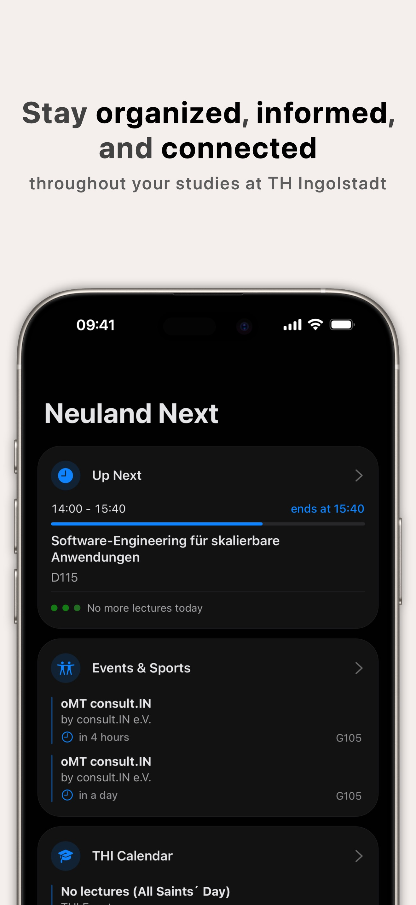
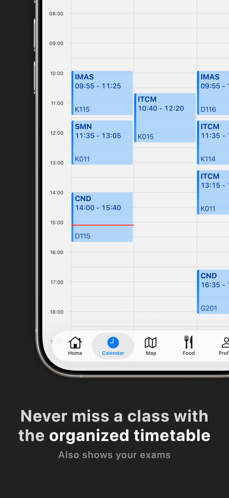
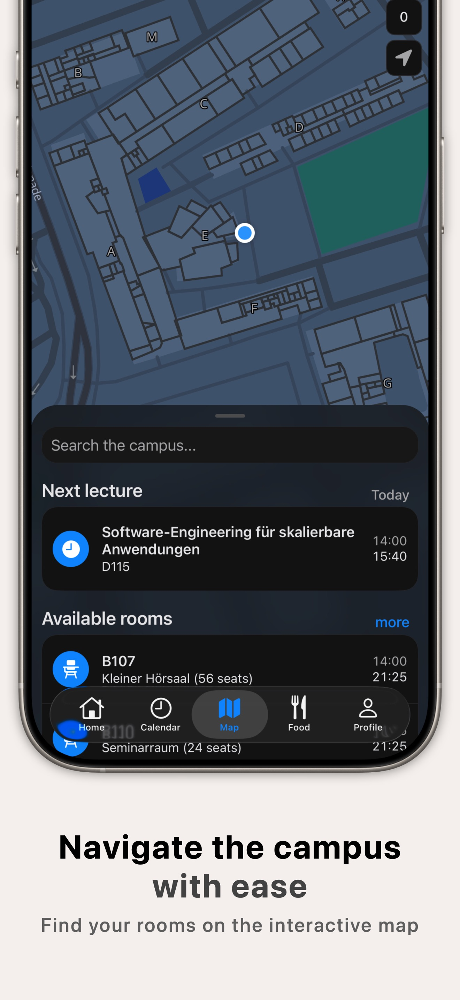

# Neuland Next - Your app for THI

  
  
  

Neuland Next is your go-to app for students of Technische Hochschule Ingolstadt (THI). Built with React Native and powered by open source, it delivers a sleek, modern experience packed with smart features—designed by students, for students.

Learn more about the app on the [Neuland Next website](https://neuland.app).

## ✨ Features

  
  
  

- **Timetable & Exams**: View your personal timetable from PRIMUSS and your exams at a glance
- **Calendar & Events**: Access all important semester dates and campus events in one place
- **University Sports**: Check out the university sports events and find your next sport activity
- **Profile**: View your grades, printer credits and much more information about your studies
- **Cafeteria**: Check the cafeteria menu, including allergen and nutritional information with support for personal preferences
- **Campus Map**: Find available rooms and explore the campus with smart suggestions and integrated search
- **Library**: Use your virtual library ID to check out at terminals to borrow and return books
- **Quick Links**: Access key university platforms such as moodle, PRIMUSS or your webmail with a single tap
- **THI News**: Stay up to date with the latest news from THI

## ℹ️ About

### 📱 App

The app unites all important information for students in one place. It's available for iOS, Android, and MacOS, with a web version that can be used on all common browsers.

Learn more about the app on the [Neuland Next website](https://neuland.app).

> [!NOTE]
> Neuland Next is an independent project by students at Technische Hochschule Ingolstadt. The app has no official connection to the university, but is used by many students and staff members.

### 🔒 Security & Privacy

- Neuland Next is built with the latest technologies and follows best practices for security and privacy
- No personal data is stored on our servers - all data is stored locally on your device
- Login credentials are stored securely in your device's secure storage (iOS keychain/Android keystore)
- The app uses the official THI API for communicating with university servers
- All communication is done directly between your device and university servers
- The complete source code is open-source and available for review

### 🏗️ Architecture

## 📊 System Status

The real-time system status is available at [status.neuland.ing](https://status.neuland.ing). Here you find information about the current status of the different services and APIs that Neuland Next depends on.

| Service | Status |  Uptime (24h)
|---------|--------|--------|
| THI API |  |  |
| Neuland API |  |  |
| Neuland Next Web |  |  |
| Neuland Next Web (dev) | /health/badge.svg) | /uptimes/24h/badge.svg) |

## 🤝 Contributing

We welcome contributions from the community! Whether you're a developer, designer, or student, you can help improve the app.

1. Fork the repository and clone it to your local machine (`Git LFS` needs to be installed)
2. Check out the [setup guide](https://neuland.app/docs/contribute/setup) for development environment setup
3. See the [contribution guidelines](https://neuland.app/docs/contribute/contribute) for more information

## 🧪 Beta Testing

Help us test the latest features before they're released to the public:

- iOS, iPadOS & macOS: [TestFlight](https://testflight.apple.com/join/PABWZys2)
- Android: [Google Play Beta Program](https://play.google.com/store/apps/details?id=app.neuland)
- Web: [dev.neuland.app](https://dev.neuland.app)

## 💬 Feedback & Support

- Report issues and bugs on [GitHub](https://github.com/neuland-ingolstadt/neuland.app-native/issues/new?assignees=&labels=bug&projects=&template=bug_report.yml&title=%5BBug%5D%3A+)
- Send feedback via email to [feedback@neuland.app](mailto:feedback@neuland.app)
- Check the [status page](https://status.neuland.app) for any ongoing issues

## 👥 About Us

Neuland Next is developed by [Neuland Ingolstadt e.V.](https://neuland-ingolstadt.de), a non-profit organization founded by students of the THI. We are independent of the university and develop the app in our free time.

## 📜 License

Neuland Next is licensed under the [GNU Affero General Public License v3.0](LICENSE).
